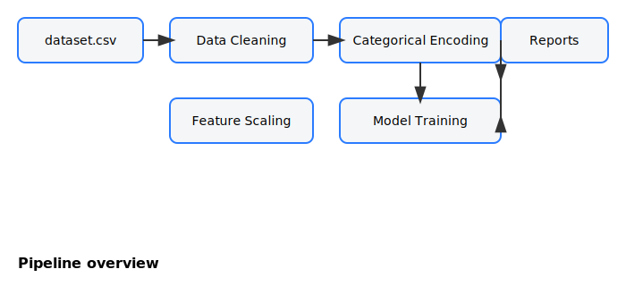
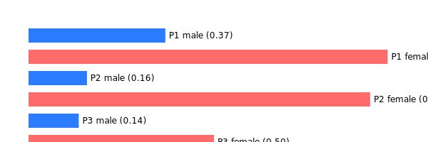

# Data Preprocessing Project

Dataset: Titanic dataset (Kaggle) — included at `data/dataset.csv`.

## Project Structure
- `data/` — raw and generated CSVs (`dataset.csv`, `cleaned_data.csv`, `encoded_*`, `scaled_*`)
- `src/` — processing scripts:
  - `data_cleaning.py` — data cleaning & preparation
  - `categorical_encoding.py` — all categorical encoding implementations
  - `feature_scaling.py` — scaling demonstrations
  - `model_train.py` — simple train/test split and model demo
- `reports/` — generated metrics (e.g., `metrics.txt`)

---

## Steps performed
1. Data Cleaning & Preparation
- Missing values: `Age` filled using median by `Pclass` & `Sex` where available, else global median; `Embarked` filled using mode; `Fare` filled by median.
- Incorrect types corrected (e.g., `Age`, `Fare` numeric; `Pclass`, `SibSp`, `Parch`, `Survived` integer).
- Outliers: Winsorized `Fare` using IQR-based capping.
- Duplicate records removed.
- Irrelevant features dropped: `PassengerId`, `Name`, `Ticket`, and `Cabin` (dropped due to many missing values).

### Quick visual summary

- Survival rates by `Pclass` and `Sex` (generated):

2. Categorical Encoding (in `src/categorical_encoding.py`)
- One-Hot Encoding
- Label Encoding
- Ordinal Encoding (supports custom orderings)
- Frequency Encoding
- Target Encoding (with smoothing)

3. Feature Scaling (in `src/feature_scaling.py`)
- Min-Max Scaling
- Max Absolute Scaling
- Vector Normalization (L2)
- Standardization (Z-score)

4. Additional Steps
- Train/Test split and a demonstration RandomForest classifier in `src/model_train.py` that writes basic metrics to `reports/metrics.txt`.
- Files demonstrating outputs are saved to `data/` (e.g., `cleaned_data.csv`, `encoded_ohe.csv`, `scaled_standard.csv`).

---

## Conclusion
- Missing value handling: Using **median** for `Age` (grouped by `Pclass` & `Sex`) worked best because `Age` has skew and group medians capture demographic differences (e.g., children or higher-class passengers). Mode for `Embarked` is natural since it's categorical with few options.
- Categorical encodings: **One-Hot** works well for low-cardinality nominal features (e.g., `Embarked`), **Target Encoding** or **Frequency Encoding** can be useful for high-cardinality features (not present here) to reduce dimensionality and capture target relationships. **Label Encoding** is only appropriate for tree-based models or when the categories have an ordinal meaning.
- Feature scaling: **Standardization (Z-score)** is generally effective when models assume or benefit from zero-mean unit-variance (e.g., distance-based models). **Min-Max** preserves bounds and is useful for many ML algorithms and visualization. **MaxAbs** is handy for sparse inputs.
- Outliers & skewness: Winsorizing `Fare` reduced the influence of extreme fares; if high skew remains, log or power transforms could be applied (not necessary after winsorization in this demo).

These choices are justified by balancing robustness (median for skewed numeric data), interpretability (dropping unhelpful columns), and model needs (appropriate encoding and scaling depending on model class).

---

## How to run
1. Install requirements: `pip install -r requirements.txt`
2. Run cleaning: `python src/data_cleaning.py`
3. Run encodings: `python src/categorical_encoding.py`
4. Run scaling demos: `python src/feature_scaling.py`
5. Train demo model: `python src/model_train.py`

### Notebook & Tests
- Notebook: open `notebooks/EDA_visualizations.ipynb` to view richer visualizations (uses matplotlib & seaborn).
- To run tests locally:
  - Install test deps: `pip install -r requirements.txt`
  - Run: `pytest -q`
- The GitHub Actions CI will also run the same tests automatically on push/PR.
